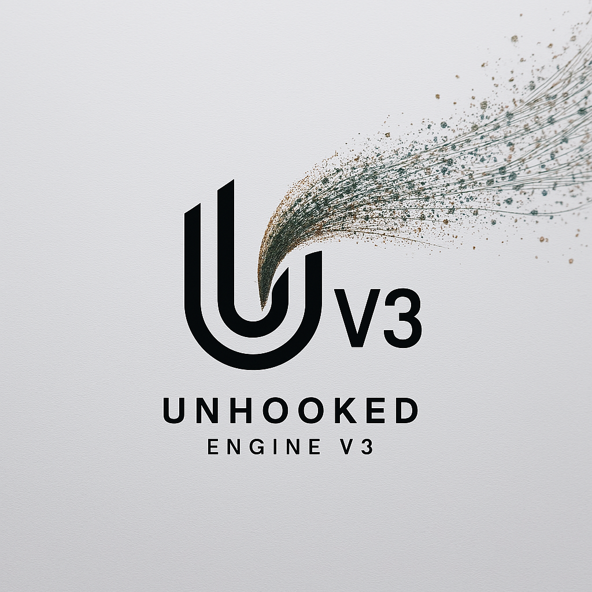
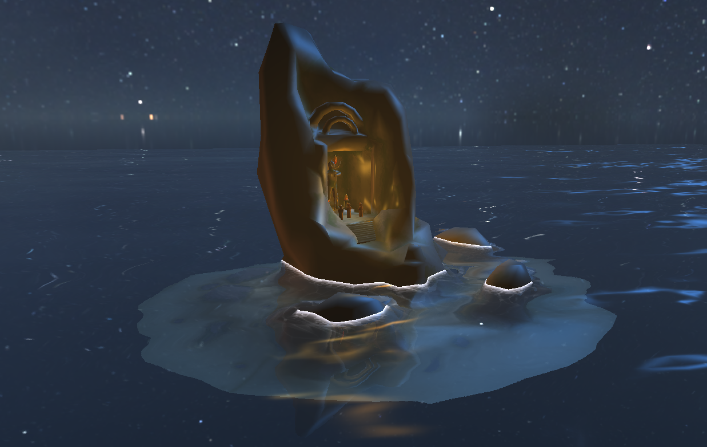
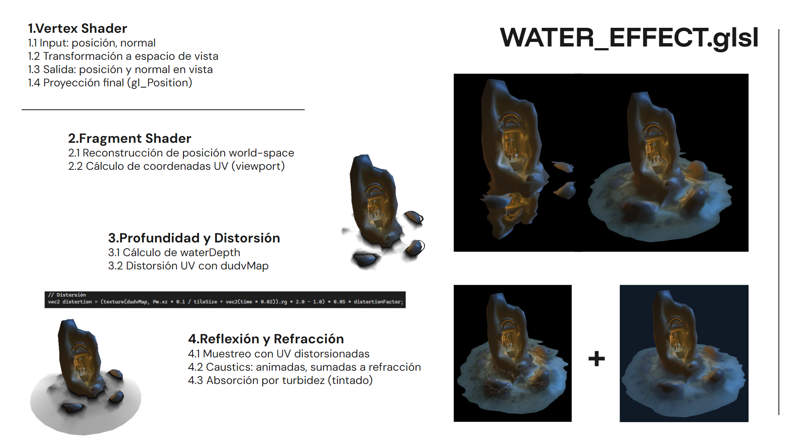
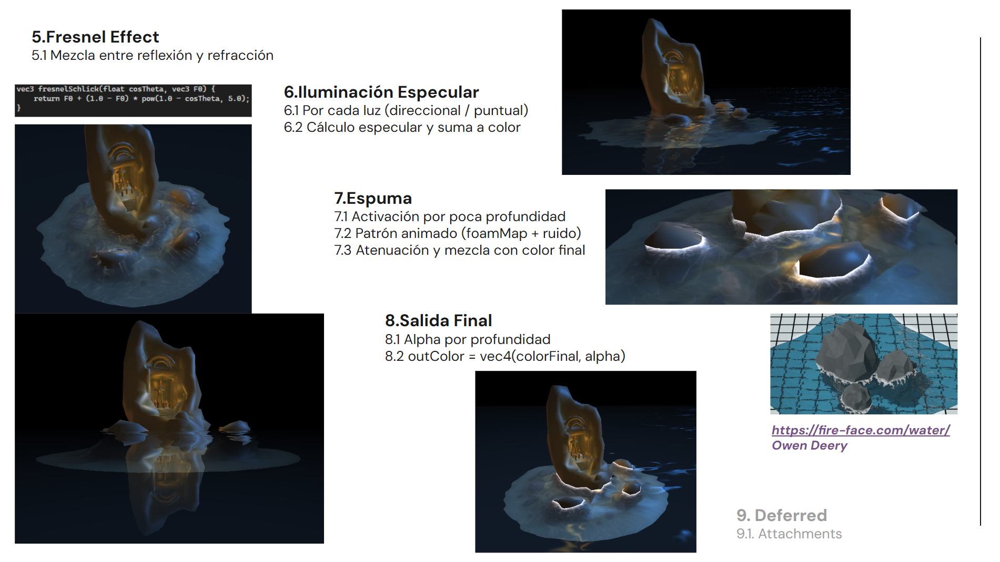

# Unhooked Engine V3

**Unhooked Engine V3** es la evolución de [**Unhooked Engine V2**](https://xdavido.github.io/UnhookedEngine.v2/Github-page/index), es un proyecto correspondiente a la asignatura "Advanced Graphics Programming" del grado en Diseño y Desarrollo de Videojuegos del CITM. 

## 🚀 Descripción del Proyecto

Este motor implementa un **motor de renderizado diferido** basado en los conceptos enseñados en clase. Su objetivo principal es gestionar de manera eficiente una escena 3D compleja con múltiples luces, utilizando un enfoque de renderizado en etapas a través de un **G-buffer**. El sistema permite la visualización interactiva de la escena, con controles en tiempo real para modificar la cámara y las luces, proporcionando una base sólida para entender cómo funcionan los motores gráficos avanzados.

## 🎯 Características Implementadas

### 🕹️ Controles de la Cámara
- **W, A, S, D**: Movimiento de la cámara en el espacio 3D.
- **E, Q**: Movimiento vertical de la cámara (arriba/abajo).
- **SHIFT**: Aumento de velocidad en el movimiento de la cámara.
- **RATÓN (Right Click)**: Rotación de la cámara alrededor de la escena.
- **SPACE**: Movimiento orbital de la cámara.

### 🏙️ Escenas 3D
El motor permite seleccionar entre dos escenas distintas, cada una con geometrías y estilos visuales diferentes:

- **Escena 1:** Una roca altar handpainted, con detalles estilizados y texturas pintadas a mano.
- **Escena 2:** Una isla low-poly con un faro, que utiliza geometría simplificada y colores planos para un estilo artístico minimalista.

Las escenas están definidas y cargadas al inicio del programa en la función **Init()**, sin soporte para carga dinámica en tiempo de ejecución.

### 🎨 Visualización G-Buffer y Framebuffer
- Puedes seleccionar entre visualizar el **G-Buffer** o el **Framebuffer** para inspeccionar el contenido del renderizado.
- El motor usa un **Framebuffer Object (FBO)** con múltiples **render targets** (texturas) para almacenar las propiedades del material de la escena, como:
  - **Albedo** (color base)
  - **Normales** (dirección de las normales)
  - **Posición** (coordenadas espaciales)
  - **ViewDir** (dirección de la vista)
  - **Depth** (profundidad de la escena)

### 💡 Sistema de Iluminación
El motor permite probar distintos tipos de luces, tanto estáticas como dinámicas:
- **Luces Direccionales**: Simuladas como quads renderizados en pantalla completa, proporcionando iluminación global.
- **Luces Puntuales**: Representadas como esferas distribuidas por la escena, afectando localmente a los objetos cercanos.

Ambos tipos de luz se configuran inicialmente en la función **Init()**, pero pueden ser editados y modificados en tiempo real utilizando **ImGui** 🛠️.

### 🌊 Water Effect
Se ha implementado un shader de agua avanzado (WATER_EFFECT.glsl) aplicable a cualquier entidad del motor. Actualmente está demostrado sobre un plano en la posición (0, 0). Este efecto incluye:

- **Reflexión:** Reflejo del entorno en tiempo real.

- **Refracción:** Distorsión del entorno bajo el agua.

- **Distorsión** dinámica mediante DuDv Map animado.

- **Especularidad** de luces usando un Normal Map para simular la incidencia de luz en la superficie.

- **Foam (espuma)** generada en función de la profundidad y cercanía a superficies.

- **Causticas** simuladas mediante una textura proyectada en base a la profundidad (Depth).

### 🌐 Environment Mapping  
#### Autor: Xiao Shan Costajussa  

Se ha implementado un sistema completo de **Image-Based Lighting (IBL)** para renderizar entornos con iluminación realista basada en HDRI. Incluye una arquitectura modular para cargar y procesar mapas HDR, con las siguientes capacidades:

- **Conversión de HDRI a Cubemap:**  Conversión de mapas equirectangulares `.hdr` a cubemaps usando un shader personalizado (`EQUIRECT_TO_CUBEMAP.glsl`), con opción de **tone mapping** integrada para gestionar exposición y corrección gamma.
  
- **Irradiance Map (Diffuse IBL):**  Convolución del cubemap para generar una versión suavizada que captura la iluminación difusa del entorno. Ideal para materiales mate.

- **Prefiltered Environment Map (Specular IBL):**  Convolución por importancia con múltiples niveles de mipmapping para simular reflejos especulares a diferentes niveles de rugosidad. El shader `PREFILTER_ENV_MAP.glsl` genera este mapa.

- **Shader combinado para IBL:**  Shader (`IBL_COMBINED.glsl`) que permite combinar el **diffuse** y **specular** IBL.

- **Tone Mapping:**   Se implementa **tone mapping exponencial**, controlable desde el inspector:
  - Activar/desactivar `USE_TONEMAP` en tiempo real.
  - Ajuste de exposición (`exposure`) para comprimir el rango dinámico y adaptar la iluminación HDR al rango LDR de pantalla.
  - Se aplica durante la conversión de HDRI, y puede alternarse para evaluar diferencias visuales.

- **Control en tiempo real con ImGui:**
  - Cambiar entre HDRIs disponibles.
  - Activar/desactivar **tone mapping** y modificar su exposición.
  - Mostrar u ocultar la esfera de prueba.

#### 🛠️ Componente Environment
Se ha diseñado un componente `Environment` con los siguientes métodos clave:

- `LoadHDRI()`: Carga y convierte un HDRI a cubemap.
- `GenerateIrradiance()`: Convoluciona y genera el mapa de irradiancia.
- `GeneratePrefiltered()`: Genera el mipmapped cubemap especular.
- `SetToneMapping()`: Activa o desactiva tone mapping.
- `BindMaps()`: Enlaza los mapas generados a cualquier shader activo.

Este sistema permite tener iluminación ambiental dinámica, adaptándose a diferentes entornos y estilos gráficos de forma interactiva.

### Assets de terceros

 [**Scene1 FBX - will.nsq**](https://sketchfab.com/will.nsq)
 
 [**Scene2 FBX - ferofluid**](https://sketchfab.com/ferofluid)

